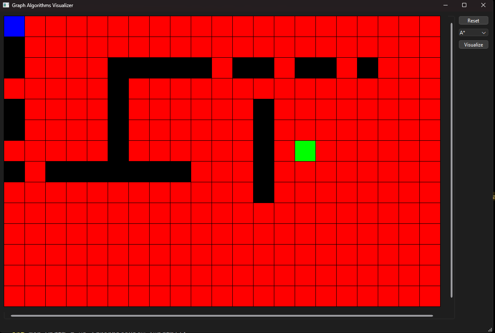

# Graph Algorithms Visualizer

## Features
- Visualize graph algorithms from the start point (0,0) to target point.
- Adding obstacles by pressing left click on squares.
- Adding the target square by pressing right click on a square.
- Ability to reset the visualization and start with different algorithm/target/obstacles.

## Supported Graph algorithms
- BFS
- DFS

## Preview
check YouTube video: https://youtu.be/5fRgi-NXamE?si=FYzD_LM0E5M3XVew

## Screenshots

## Tools
- Qt C++ 6.7.0

## To-Do
- Support more graph algorithms!