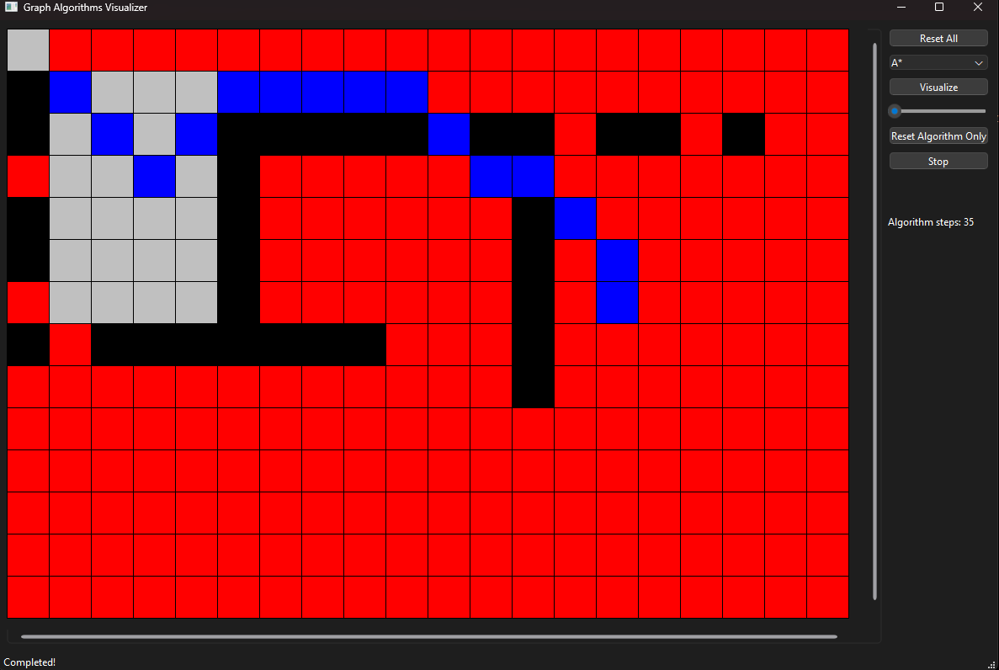

# Graph Algorithms Visualizer

## Features
- Visualize graph algorithms from the start point (0,0) to target point.
- Adding obstacles by pressing left click on squares.
- Adding the target square by pressing right click on a square.
- Ability to reset the visualization and start with different algorithm/target/obstacles.
- Reconstruct the path in blue when target square is found.
- Ability to search diagonal neighbours.
- Ability to clear only algorithm visualization and keep obstacles.
- Ability to stop/cancel visualization while processing (you have to press on "Reset All" or "Reset Algorithm Only" to visualize again)
- Ability to speed up or slow down visualization speed.
- Display algorithms steps (to compare time between multiple agorithms).

## Supported Graph algorithms
- BFS
- DFS
- A* (AI generated)
- Dijkstra

## Preview
check YouTube video: https://youtu.be/5fRgi-NXamE?si=FYzD_LM0E5M3XVew

## Screenshots

## Tools
- Qt C++ 6.7.0

## To-Do
- Support more graph algorithms!
- Use Strategy design pattern for different graph algorithms.
